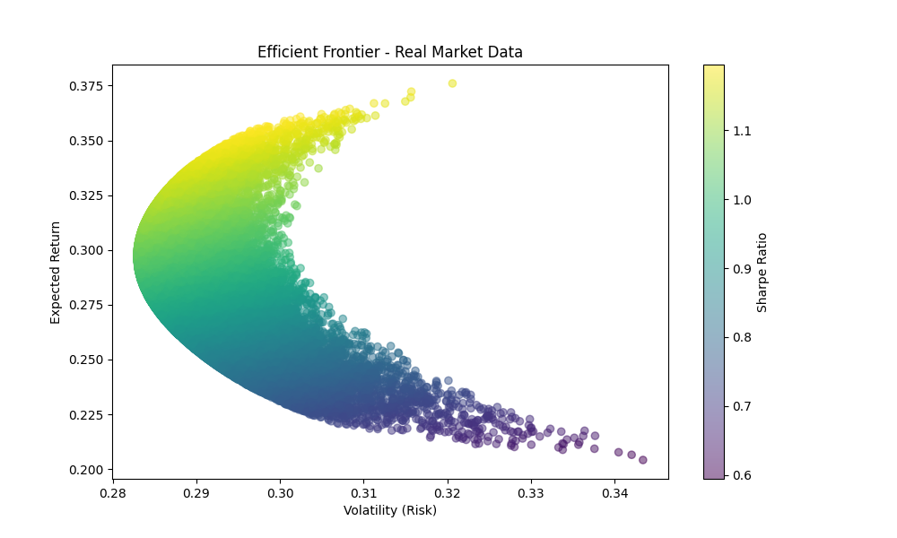

### Overview
Performs Monte Carlo Simulations on real stock market data to identify the optimal investment portfolio based on risk and return. The program outputs the Efficient Frontier and determines the portfolio with the highest Sharpe Ratio (best risk-adjusted return) and the minimum volatility portfolio (least risky portfolio).

## Feature
* Fetches real historic stock data using Yahoo Finance API
* Calculates expected returns, volatility and Sharpe Ratio for various portfolios
* Runs Monte Carlo simulations to randomly generated thousands of portfolio allocations
* Plots the Efficient Frontier
* Interactive CLI

## To Do
[] Add command-line option for easier access
[] Clean up and modularise code

## Installation
1. Clone the repository:
```bash
git clone https://github.com/nathancyc/montecarlo
cd MonteCarloPortfolioOptimization
```

2. Set up a virtual environment (recommended)
```bash
conda create -n monte python
conda activate monte
```

3. Install dependencies
```bash
pip install -r requirements.txt
```

## Running the Program
Run the script from the ```src/``` directory
```bash
python src/main.py
```

# Example Output:
```bash
----- Best Portfolio (Highest Sharpe Ratio) -----
Annualized Return: 35.52%
Annualized Volatility: 29.72%
Sharpe Ratio: 1.20
Weights:
  AAPL: 62.03%
  MSFT: 37.17%
  GOOGL: 0.20%
  AMZN: 0.60%

----- Minimum Volatility Portfolio -----
Annualized Return: 29.71%
Annualized Volatility: 28.30%
Sharpe Ratio: 1.05
Weights:
  AAPL: 25.77%
  MSFT: 32.19%
  GOOGL: 27.67%
  AMZN: 14.37%

```

